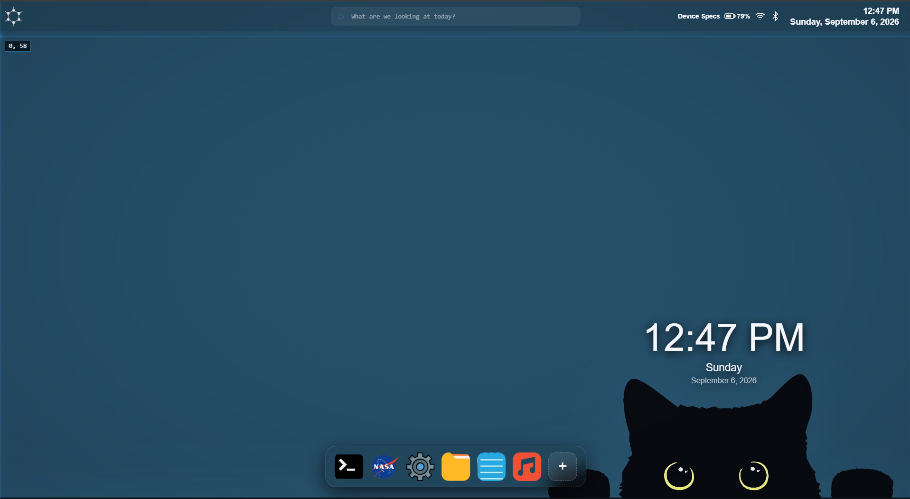

# FluxOS V2


What is it?, Its a web-based based Operating System simulation( Which I had to Overcomplicate )



# Features

- Custom BIOS Boot Screen
- Draggable, Minimsable annd Maximisable Windows
- App Dock
- Google Taskbar Search
- Accent Custmosation and Auto Accent
- Window Transparency Settings 
- Real-time Widgets
- Persistent memory system
- Device Info , Cursor Effect and Interactive Pet

# Applications 
- Local Audio Player (Mp3, Opus and other browser supported formats)
- Terminal - (Available commands: help, time, clear, reboot)
- File Manager - (Auto-save, Browser based VFS, Renamable files ) 
- NASA Uplink ( Live Space Station Data )
- Settings ( Control Accents, Opacity, transluceny, Wallpaper modes and Pet)

# Project Structure
```
Flux-OS/
├── index.html
├── style.css
├── script.js
├── app-factory.js
├── accent-engine.js
├── wallpaper-shift.js
├── taskbar.js
├── web-search.js
├── dock-autohide.js
├── clock-widget.js
├── music.js
├── reptile.js
├── aesthetics.js
└── icons/
```
Architecture
# How to use it


## 1) Run Locally

### Clone Repo
```
 git clone https://github.com/the-degenerate-otaku/Flux-OS
 cd Flux-OS
```
### Start Local Server
>py -m http.server 5500

### Open:
> http://127.0.0.1:5500


## 2) Direct Link
> https://the-degenerate-otaku.github.io/Flux-OS/

# Tech Stack

- HTML5
- JS
- CSS3
- Canvas API
- WebAudio API
- GSAP
- Three.js
- Vanta.js

# Build For

- Stardance - Hackclub
